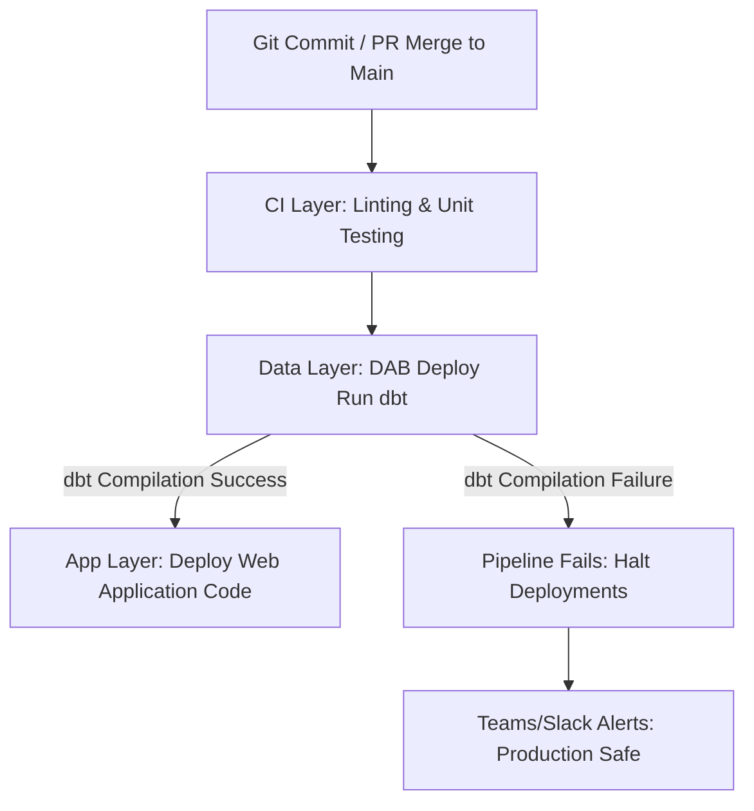

# Design Document: Monorepo Full-Stack Application with DABs and dbt

## Status

| Field | Value |
| --- | --- |
| **Status** | DRAFT |
| **Updated** | 2026-05-26 |

---

## Abstract

This document outlines the architecture for a unified **DataOps and Application Monorepo** framework on Databricks. By combining **Databricks Asset Bundles (DABs)** with **dbt (Data Build Tool)**, this platform bridges the gap between software engineering and data science. It enables a data science team to maintain raw SQL workflows while automating environment isolation, schema migration, and custom web application deployment without the overhead of traditional row-based ORMs.

## Background

The current development cycle suffers from critical engineering bottlenecks: manual SQL execution, resource name-hacking (e.g., suffixed tables) within shared environments, and a lack of environment isolation between development and production. The team is building a custom web application (React frontend, Python API backend) that interacts directly with Databricks data. Because the primary developers are data scientists proficient in SQL, traditional software engineering database migration frameworks (SQLAlchemy/Alembic) introduce prohibitive friction and performance degradation on OLAP/Delta Lake architectures.

## Goals & Non-Goals

### Goals

* [ ] **Unify the Stack:** Establish a structured Monorepo grouping the React frontend, Python API backend, and dbt transformations.
* [ ] **Maintain Raw SQL Familiarity:** Implement dbt to compile and automate DDL changes natively from standard `SELECT` statements.
* [ ] **Absolute Environment Isolation:** Enforce zero code modifications or table name adjustments between targets by leveraging **Unity Catalog** namespaces.
* [ ] **Atomic CI/CD Orchestration:** Automate deployments using a GitHub Actions pipeline driven by a **Service Principal (SPN)** to ensure schemas update before application code drops.

### Non-Goals

* [ ] Forcing transactional ORMs (SQLAlchemy, SQLModel) onto analytical Delta Lake tables.
* [ ] Tuning low-level PySpark processing or custom SQL query execution plans.

---

## Proposed Architecture

### 1. Monorepo Directory Strategy

To ensure atomic deployments and eliminate schema drift (where the frontend/API breaks due to out-of-sync data structures), the repository houses data transformations, backend APIs, and frontend assets under one versioned umbrella.

```text
analytics-platform-monorepo/
├── .github/workflows/
│   └── deploy.yml            # Automated CI/CD pipeline script
├── databricks.yml            # DAB coordinator configuration (The Skeleton)
├── dbt_project/              # DATA TIER: Managed by Data Scientists
│   ├── dbt_project.yml       # dbt metadata configuration
│   ├── models/               # Raw SQL SELECT files (.sql)
│   └── profiles.yml          # Connection schema configuration
└── src/                      # APPLICATION TIER: Hosted via Databricks Apps
    ├── frontend/             # React application (UI Components)
    └── backend/              # Python API (FastAPI thin data translation layer)

```

### 2. Environment Strategy & Unity Catalog Namespacing

Rather than manually renaming tables (e.g., `my_table_dev` vs `my_table_prod`) inside a single environment, the architecture mandates dedicated Databricks workspaces and a three-tier Unity Catalog namespace mapping (`catalog.schema.table`). Code references remain static; environmental routing is handled dynamically at the deployment layer.

| Environment Target | Target Workspace | Unity Catalog Target |
| --- | --- | --- |
| **Development** | `workspace-dev.azuredatabricks.net` | `dev_catalog.analytics.orders` |
| **Staging** | `workspace-staging.azuredatabricks.net` | `staging_catalog.analytics.orders` |
| **Production** | `workspace-prod.azuredatabricks.net` | `prod_catalog.analytics.orders` |

### 3. State-Based Change Management and Rollback Pattern

* **State Management:** Unlike migration-based engines (Alembic) that track delta scripts, dbt is state-based. It compiles project declarations into a `manifest.json` file. CI workflows cache this file in cloud object storage to run **Slim CI** (`dbt run --select state:modified`), updating only files that changed in a PR.
* **Code Rollback:** Reverting a broken feature is handled via Git. Reverting a commit on `main` triggers dbt to re-evaluate the previous SQL file state and re-compile the target tables to match that exact structural logic.
* **Data Rollback:** If historical data is corrupted during an execution, the architecture leverages Delta Lake's native **Time Travel** capability to restore tables to a healthy timestamp instantly, bypassing transactional down-migrations:
```sql
RESTORE TABLE prod_catalog.analytics.orders TO TIMESTAMP AS OF '2026-05-25 12:00:00';

```


---

## Technical Specifications

### 1. Unified Infrastructure: `databricks.yml`

The DAB file coordinates both data architecture and custom web server resources, executing schema migrations via a serverless SQL Warehouse before initializing or refreshing the application tier (**Databricks Apps**).

```yaml
bundle:
  name: dynamic-analytics-app

targets:
  dev:
    workspace:
      host: https://adb-dev.azuredatabricks.net
    variables:
      env: dev
      catalog: dev_catalog
  prod:
    workspace:
      host: https://adb-prod.azuredatabricks.net
    variables:
      env: prod
      catalog: prod_catalog

resources:
  jobs:
    dbt_migration_job:
      name: "data-schema-sync-${var.env}"
      tasks:
        - task_key: run_dbt
          warehouse_id: 1234567890abcdef
          dbt:
            project_directory: ./dbt_project
            commands:
              - "dbt deps"
              - "dbt run --target ${var.env} --vars 'catalog: ${var.catalog}'"

  apps:
    custom_web_application:
      name: "analytics-portal-${var.env}"
      source_code_path: ./src

```

### 2. Custom Web Application Presentation Layer (Python Backend)

To maintain velocity without risking data fragmentation or high commit latency from an ORM, the Python backend serves as a thin validation wrapper utilizing **Pydantic** and the official `databricks-sql-python` client.

```python
from databricks import sql
from pydantic import BaseModel
from fastapi import FastAPI

app = FastAPI()

class MetricResponse(BaseModel):
    region: str
    total_sales: float
    active_users: int

@app.get("/api/metrics")
def get_metrics():
    # Queries the clean, optimized view generated by the data scientist's dbt model
    with sql.connect(server_hostname="...", http_path="...", access_token="...") as conn:
        with conn.cursor() as cursor:
            cursor.execute("SELECT region, total_sales, active_users FROM prod_catalog.analytics.dashboard_metrics")
            result = cursor.fetchall()
            
            # Converts SQL response into strictly-typed JSON objects for React frontend
            return [MetricResponse(region=row.region, total_sales=row.total_sales, active_users=row.active_users) for row in result]

```

---

## CI/CD Orchestration Flow

The execution logic mandates an **Atomic Pipeline Pattern**. When a Pull Request is merged into the production branch, a secure Service Principal identity is assumed, triggering the steps sequentially.



1. **Continuous Integration:** The runner executes syntax linters and local configurations tests (`pytest`) against feature branch commits.
2. **Data Layer Schema Updates:** The bundle uploads code and forces execution of the Databricks `dbt_migration_job`. dbt builds or amends tables/views directly inside the environment's specific Unity Catalog.
3. **Application Deployment:** Only upon successful database execution does the pipeline roll forward to deploy backend API and React updates, safeguarding user interfaces from mismatched backend definitions.
