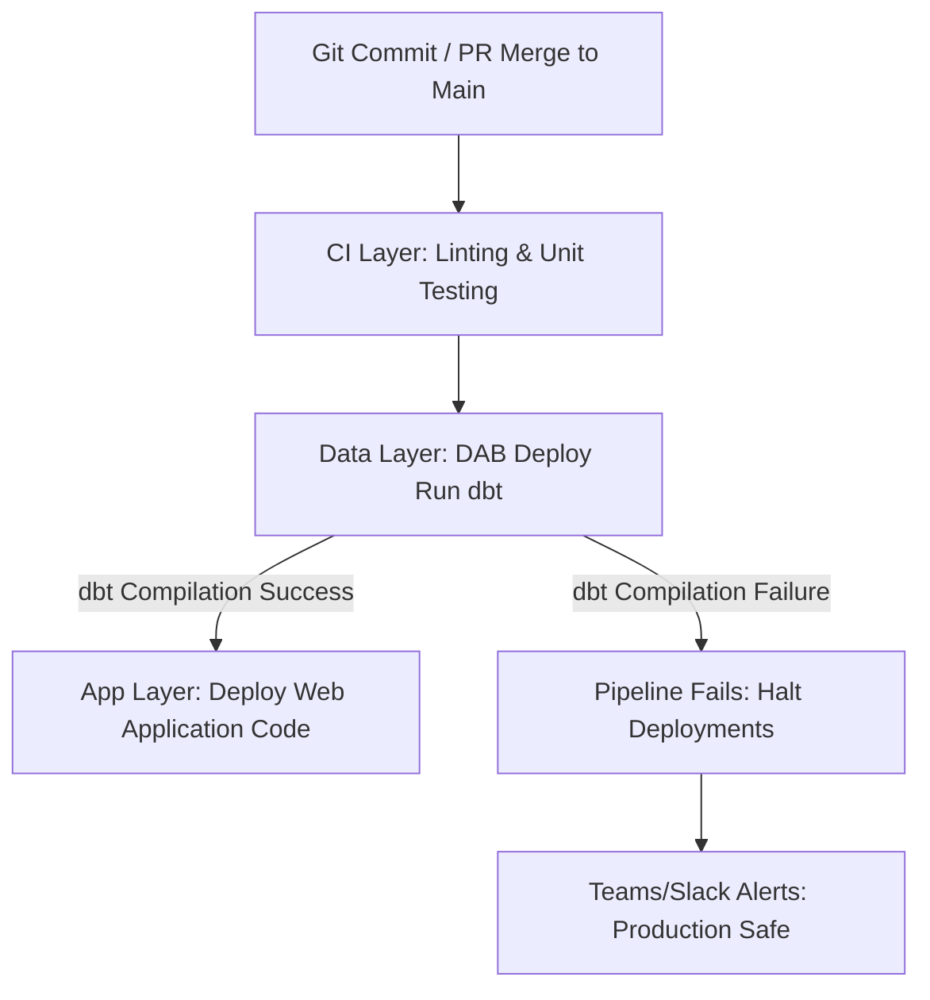

# Design Document: Monorepo Full-Stack Application with DABs and dbt

## Status

| Field | Value |
| --- | --- |
| **Status** | DRAFT |
| **Updated** | 2026-05-26 |

---

## Abstract

This document outlines the architecture for a unified **DataOps and Application Monorepo** framework on Databricks. By combining **Databricks Asset Bundles (DABs)** with **dbt (Data Build Tool)**, this platform bridges the gap between software engineering and data science. It enables a data science team to maintain raw SQL workflows while automating environment isolation, schema migration, and custom web application deployment without the overhead of traditional row-based ORMs.

## Background

The current development cycle suffers from critical engineering bottlenecks: manual SQL execution, resource name-hacking (e.g., suffixed tables) within shared environments, and a lack of environment isolation between development and production. The team is building a custom web application (React frontend, Python API backend) that interacts directly with Databricks data. Because the primary developers are data scientists proficient in SQL, traditional software engineering database migration frameworks (SQLAlchemy/Alembic) introduce prohibitive friction and performance degradation on OLAP/Delta Lake architectures.

## Goals & Non-Goals

### Goals

* [ ] **Unify the Stack:** Establish a structured Monorepo grouping the React frontend, Python API backend, and dbt transformations.
* [ ] **Maintain Raw SQL Familiarity:** Implement dbt to compile and automate DDL changes natively from standard `SELECT` statements.
* [ ] **Absolute Environment Isolation:** Enforce zero code modifications or table name adjustments between targets by leveraging **Unity Catalog** namespaces.
* [ ] **Atomic CI/CD Orchestration:** Automate deployments using a GitHub Actions pipeline driven by a **Service Principal (SPN)** to ensure schemas update before application code drops.

### Non-Goals

* [ ] Forcing transactional ORMs (SQLAlchemy, SQLModel) onto analytical Delta Lake tables.
* [ ] Tuning low-level PySpark processing or custom SQL query execution plans.

---

## Proposed Architecture

### 1. Monorepo Directory Strategy

To ensure atomic deployments and eliminate schema drift (where the frontend/API breaks due to out-of-sync data structures), the repository houses data transformations, backend APIs, and frontend assets under one versioned umbrella.

```text
analytics-platform-monorepo/
├── .github/workflows/
│   └── deploy.yml            # Automated CI/CD pipeline script
├── databricks.yml            # DAB coordinator configuration (The Skeleton)
├── dbt_project/              # DATA TIER: Managed by Data Scientists
│   ├── dbt_project.yml       # dbt metadata configuration
│   ├── models/               # Raw SQL SELECT files (.sql)
│   └── profiles.yml          # Connection schema configuration
└── src/                      # APPLICATION TIER: Hosted via Databricks Apps
    ├── frontend/             # React application (UI Components)
    └── backend/              # Python API (FastAPI thin data translation layer)

```

### 2. Environment Strategy & Unity Catalog Namespacing

Rather than manually renaming tables (e.g., `my_table_dev` vs `my_table_prod`) inside a single environment, the architecture mandates dedicated Databricks workspaces and a three-tier Unity Catalog namespace mapping (`catalog.schema.table`). Code references remain static; environmental routing is handled dynamically at the deployment layer.

| Environment Target | Target Workspace | Unity Catalog Target |
| --- | --- | --- |
| **Development** | `dss-svc-eng-nonprod-us-east-1.cloud.databricks.com` | `dev_catalog` |
| **Production** | `dss-svc-eng-prod-us-east-1.cloud.databricks.com` | `prod_catalog` |

### 3. State-Based Change Management and Rollback Pattern

* **State Management:** Unlike migration-based engines (Alembic) that track delta scripts, dbt is state-based. It compiles project declarations into a `manifest.json` file. CI workflows cache this file in cloud object storage to run **Slim CI** (`dbt run --select state:modified`), updating only files that changed in a PR.
* **Code Rollback:** Reverting a broken feature is handled via Git. Reverting a commit on `main` triggers dbt to re-evaluate the previous SQL file state and re-compile the target tables to match that exact structural logic.
* **Data Rollback:** If historical data is corrupted during an execution, the architecture leverages Delta Lake's native **Time Travel** capability to restore tables to a healthy timestamp instantly, bypassing transactional down-migrations:
```sql
RESTORE TABLE prod_catalog.analytics.dashboard_metrics TO TIMESTAMP AS OF '2026-05-25 12:00:00';

```


---

## Technical Specifications

### 1. Unified Infrastructure: `databricks.yml`

The DAB file coordinates both data architecture and custom web server resources, executing schema migrations via a serverless SQL Warehouse before initializing or refreshing the application tier (**Databricks Apps**).

```yaml
bundle:
  name: dynamic-analytics-app

targets:
  dev:
    workspace:
      host: https://dss-svc-eng-nonprod-us-east-1.cloud.databricks.com
    variables:
      env: dev
      catalog: dev_catalog
  prod:
    workspace:
      host: https://dss-svc-eng-prod-us-east-1.cloud.databricks.com
    variables:
      env: prod
      catalog: prod_catalog

resources:
  jobs:
    dbt_migration_job:
      name: "data-schema-sync-${var.env}"
      tasks:
        - task_key: run_dbt
          warehouse_id: 1234567890abcdef
          dbt:
            project_directory: ./dbt_project
            commands:
              - "dbt deps"
              - "dbt run --target ${var.env} --vars 'catalog: ${var.catalog}'"

  apps:
    custom_web_application:
      name: "analytics-portal-${var.env}"
      source_code_path: ./src

```

### 2. Custom Web Application Presentation Layer (Python Backend)

To maintain velocity without risking data fragmentation or high commit latency from an ORM, the Python backend serves as a thin validation wrapper utilizing **Pydantic** and the official `databricks-sql-python` client.

```python
from databricks import sql
from pydantic import BaseModel
from fastapi import FastAPI

app = FastAPI()

class MetricResponse(BaseModel):
    region: str
    total_sales: float
    active_users: int

@app.get("/api/metrics")
def get_metrics():
    # Queries the clean, optimized view generated by the data scientist's dbt model
    with sql.connect(server_hostname="...", http_path="...", access_token="...") as conn:
        with conn.cursor() as cursor:
            cursor.execute("SELECT region, total_sales, active_users FROM prod_catalog.analytics.dashboard_metrics")
            result = cursor.fetchall()
            
            # Converts SQL response into strictly-typed JSON objects for React frontend
            return [MetricResponse(region=row.region, total_sales=row.total_sales, active_users=row.active_users) for row in result]

```

---

## CI/CD Orchestration Flow

The execution logic mandates an **Atomic Pipeline Pattern**. When a Pull Request is merged into the production branch, a secure Service Principal identity is assumed, triggering the steps sequentially.



1. **Continuous Integration:** The runner executes syntax linters and local configurations tests (`pytest`) against feature branch commits.
2. **Data Layer Schema Updates:** The bundle uploads code and forces execution of the Databricks `dbt_migration_job`. dbt builds or amends tables/views directly inside the environment's specific Unity Catalog.
3. **Application Deployment:** Only upon successful database execution does the pipeline roll forward to deploy backend API and React updates, safeguarding user interfaces from mismatched backend definitions.

Here are the new sections to integrate directly into your design document, establishing a clear development lifecycle, Git tag versioning strategy, and step-by-step rollback playbooks.

---

## 3.4 Local Development to CI/CD Workflow

This section outlines how data scientists safely write, test, and promote SQL changes through the monorepo lifecycle, eliminating the anti-pattern of manual production code edits.

```text
[Local Sandbox] ──> [Git Push & PR] ──> [Slim CI Validation] ──> [Merge & Production Deploy]
```

### Step 1: Isolated Sandbox Development

Data scientists work inside their personal sandbox schemas using the dbt CLI or Databricks Notebooks. Using the configuration wrapper (`Taskfile.yml`), they compile and test queries locally against their isolated Unity Catalog development catalog:

```bash
# Developer runs dbt targeted at their personal sandbox
task db-run:sandbox
# Expands to: dbt run --target dev --vars 'catalog: dev_user_sandbox'

```

### Step 2: Continuous Integration & Slim CI

When a developer completes a feature, they commit code using **Conventional Commits** and open a Pull Request against `main`.

GitHub Actions intercepts the PR and executes a **Slim CI** run. Instead of rebuilding all data models (which wastes time and compute), the pipeline fetches the production state artifact (`manifest.json`) from cloud storage and processes *only the modified files*:

```yaml
- name: Run Slim CI for Pull Request
  run: |
    dbt deps
    dbt run --select state:modified --state ./prod_artifacts/ --target dev
    dbt test --select state:modified --state ./prod_artifacts/ --target dev

```

### Step 3: Production Promotion & Testing

Once the PR passes checks and peer review, it is merged into `main`. The merge triggers an automated push to the Production Workspace, executing full integration tests to guarantee that backend application APIs map perfectly to the newly generated database views.

---

## 5. Versioning via Git Tags

To replace untracked production deployments, this platform treats Git tags as immutable snapshots of both the infrastructure layout (DABs), the data models (dbt), and application files (React/Python).

### 5.1 Automated Tag Generation

When using the standard release path, the `release-please` automation aggregates squash-merged commits on `main`. Once a release PR is merged, the system automatically creates a semantic Git tag (e.g., `v1.2.0`) and publishes a GitHub Release.

### 5.2 Production Tag Deployment Workflow

Production deployments are strictly bound to these version tags. This guarantees that code running in production matches an exact, auditable point in history.

```yaml
name: Production Release Deployment
on:
  release:
    types: [published] # Triggered automatically when a Git tag is minted

jobs:
  production-deploy:
    runs-on: ubuntu-latest
    steps:
      - name: Checkout Code at Specific Tag
        uses: actions/checkout@v4
        with:
          ref: ${{ github.event.release.tag_name }} # Checks out v1.2.0 explicitly

      - name: Deploy Full Monorepo Bundle
        run: task db-deploy:prod
        env:
          DATABRICKS_HOST: ${{ secrets.PROD_HOST }}
          DATABRICKS_TOKEN: ${{ secrets.PROD_SPN_TOKEN }}
          BUNDLE_VERSION: ${{ github.event.release.tag_name }}

```

---

## 6. Emergency Rollback Playbooks

When a production deployment introduces a bug, the team executes one of two deterministic rollback paths depending on whether the failure stems from a **software logic error** or **data corruption**.

### Playbook A: Code & Schema Rollback (Git-Driven)

*Use this when a query logic error or column schema modification breaks the Python API or React components.*

Because dbt is state-based, rolling back the database requires rolling back the Git history. This resets the "desired state" of the database, prompting the CI/CD pipeline to automatically downgrade the production schemas.

```bash
# 1. Locate the broken commit and the known healthy tag (e.g., v1.1.5)
git log --oneline

# 2. Create an emergency hotfix branch from main
git checkout -b hotfix/revert-v1.2.0 main

# 3. Revert the broken merge commit
git revert -m 1 [BROKEN_COMMIT_SHA]

# 4. Commit and push using the conventional commit syntax to bypass release blocks
git commit -m "fix!: revert data schema changes back to v1.1.5"
git push origin hotfix/revert-v1.2.0

```

> **Automation Result:** Once merged back to `main`, a new version tag is minted (e.g., `v1.2.1`). The CI/CD pipeline automatically executes `dbt run`, which evaluates the reverted code structure and alters or recreates the production tables/views to mirror the original `v1.1.5` operational baseline.

### Playbook B: Data Corruption Rollback (Delta Lake Time Travel)

*Use this when a bad deployment or query run successfully applies but corrupts, duplicates, or deletes historical underlying data records.*

If data is corrupted, do not wait for a full Git pipeline to rebuild historical records. Leverage Delta Lake’s immutable transaction log to instantaneously roll database state backward in time.

```sql
-- 1. Inspect the history of the table to find the last healthy transaction ID or Timestamp
DESCRIBE HISTORY prod_catalog.analytics.dashboard_metrics;

-- 2. Validate data at a specific healthy point in history to ensure correctness
SELECT * FROM prod_catalog.analytics.dashboard_metrics TIMESTAMP AS OF "2026-05-26 08:00:00";

-- 3. Execute an atomic, instantaneous restoration of the table state
RESTORE TABLE prod_catalog.analytics.dashboard_metrics TO TIMESTAMP AS OF "2026-05-26 08:00:00";

```

> **Automation Result:** The `RESTORE` command commits a brand new transaction to the Delta log, instantly making the corrupted rows disappear for the Python API layer. The operation finishes in seconds regardless of table size because it modifies metadata pointers rather than rewriting large underlying physical data files.
