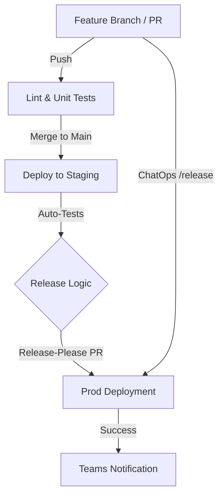

# Design Document: Databricks DataOps Platform

## 1. Overview

The primary objective of this platform is to automate the deployment of Databricks resources while strictly protecting the integrity of **Staging** and **Production** environments. By employing a **Colocated DAB Pattern**, we solve the critical issue of resource duplication—preventing scenarios where dashboards or jobs with identical names are accidentally published or overwritten. This system utilizes **GitHub Actions** to orchestrate a robust CI/CD pipeline, ensuring that every change is validated, versioned, and promoted through a structured lifecycle.

## 2. Environment Strategy & Isolation

The platform utilizes a three-tier architecture to isolate development from business-critical assets:

* **Sandbox**: Personal development areas where unique namespaces are generated per user and branch to prevent collisions.
* **Staging**: The integration layer where code is automatically validated against a production-like environment.
* **Production**: The restricted "Source of Truth," accessible only through automated service principals.

> **Note**: While the standard flow follows a structured promotion, an **accelerated release path** exists. This "escape hatch" allows developers to bypass the formal release-please PR by using a chatbot command directly within their feature PR. Detailed logic for this is provided in Section 6.2.

---

## 3. CI/CD & The "Fast-Track" Release

This section outlines the lifecycle of a code change as it moves through the automated pipeline. The platform employs a dual-path deployment strategy: a standard, versioned release cycle for planned updates and a "Fast-Track" ChatOps path for emergency hotfixes and urgent deliveries.

### 3.1 Workflow Visualization



### 3.2 The Deployment Workflow

1. **Continuous Integration (CI)**: Pushes to any feature branch trigger automated linting and unit tests to ensure code quality before reaching the peer review stage.
2. **Staging Promotion**: Upon merging a Pull Request into the `main` branch, the bundle is automatically deployed to the Staging environment.
3. **Integration Testing**: Automated resource validation tests run against the Staging environment to confirm that the Databricks Jobs, DLT pipelines, and Dashboards function correctly in a production-like setting.
4. **Version Management**: The `release-please` action monitors the `main` branch, automatically aggregating commits to create a Release PR that handles Semantic Versioning (SemVer) and changelog updates.
5. **Production Release**: Merging the Release PR triggers the production workflow, deploying assets to the Production environment using a Service Principal identity for maximum security.
6. **Fast-Track "Escape Hatch"**: Developers can bypass the standard release cycle by commenting `/release` on an open PR. This triggers an immediate merge to `main` and initiates the Production deployment pipeline, providing an accelerated path for urgent changes.

### 3.3 Automated Versioning (SemVer)

We use **Release Please** to calculate version bumps based on Conventional Commits:

* **`fix:`** ➔ Patch (1.0.1)
* **`feat:`** ➔ Minor (1.1.0)
* **`feat!:`** ➔ Major (2.0.0)

**ChatOps Feedback Loop:**

* **Start**: "🚀 Fast-Track Release Initialized. I’m merging this feature and triggering the production release now."
* **Complete**: "✅ Release Complete. The Release PR has been merged, and the Production deployment is underway."
* **Failure**: "❌ Fast-Track Release Failed. I encountered an error... Please check GitHub Actions logs."

---

## 4. Standardized Project Blueprint

This layout is the mandatory standard for all current and future Databricks projects to ensure cross-team compatibility and ease of maintenance.

```text
.
├── databricks.yml              # Main coordinator (The "Skeleton")
├── Taskfile.yml                # Command abstraction layer
├── .github/
│   └── workflows/              # CI/CD Pipeline definitions
├── targets/                    # Environment-specific overrides
│   ├── sandbox.yml             # Personal dev settings
│   ├── staging.yml             # Integration settings
│   └── prod.yml                # Production Service Principal settings
├── resources/                  # Shared resource definitions
│   ├── jobs.yml                # Workflow definitions
│   ├── pipelines.yml           # DLT definitions
│   └── dashboards.yml          # AI/BI Dashboard definitions
├── src/                        # Code (Notebooks, Python, SQL)
├── scripts/                    # Automation (db_setup.sh, db_notify.sh)
├── tests/                      # Pytest validation suites
├── requirements-dev.txt        # Local dev dependencies
└── .gitignore                  # Excludes .bundle/, secrets, and caches


```

---

## 5. Configuration & Automation Components

### 5.1 The Coordinator (`databricks.yml`)

The Databricks Asset Bundle (DAB) is a declarative framework that allows you to define your Databricks resources as code. The `databricks.yml` file acts as the primary "Skeleton," importing resources and defining global variables that the Databricks CLI uses to assemble the deployment package.

```yaml
bundle:
  name: marketing_analytics

include:
  - targets/*.yml
  - resources/*.yml


```

### 5.2 Target Overrides (`targets/`)

Targets provide environment-specific configurations. The CLI merges the base bundle with the specific target logic during deployment.

* **Sandbox**: For local iteration. Unique `root_path` prevents overwriting others' work.
* **Staging**: For final integration testing before production.
* **Production**: The locked environment using **Service Principal** identities.

**Variables and CLI Arguments:**
Variables allow for dynamic configuration. For example, in `sandbox.yml`, we use:

* `${workspace.current_user.short_name}`: To identify the developer.
* `${bundle.git_branch}`: To isolate different features.

You can override these via the CLI:
`databricks bundle deploy -t sandbox --var "catalog_name=experimental_catalog"`

### 5.3 Resource Definitions (`resources/`)

Files in this directory define the *what* of your project . By modularizing these, you can manage complex workflows in smaller, readable chunks.

The `resources/` directory defines the high-level Databricks objects (Jobs, DLT Pipelines, Dashboards) that the bundle will create and manage. By separating these into logical files, we maintain a clean and scalable configuration that can be easily reviewed during the PR process.

#### 5.3.1 Resource Categorization

Resources are split by type to prevent a single, unmanageable YAML file:

* **`dashboards.yml`**: Defines AI/BI dashboards, including layout, widgets, and data sources.
* **`jobs.yml`**: Configures multi-task workflows, including trigger schedules (cron), email notifications on failure, and cluster requirements.
* **`pipelines.yml`**: Specific to Delta Live Tables (DLT), defining materialization logic and data quality constraints (Expectations).

#### 5.3.2 Resource Overrides & Shared Logic

Because the `databricks.yml` coordinates these files, you can define a "base" resource and then apply environment-specific tweaks in your targets. For example, a job might run on a small shared cluster in **Staging** but move to a high-concurrency SQL Warehouse in **Production**.

#### 5.3.3 Implementation Example: `resources/jobs.yml`

```yaml
resources:
  jobs:
    daily_ingestion_job:
      name: "[${bundle.target}] Daily Sales Ingestion"
      tasks:
        - task_key: refresh_tables
          notebook_task:
            notebook_path: ../src/notebooks/ingest_sales.py
      job_clusters:
        - job_cluster_key: default_cluster
          new_cluster:
            spark_version: "14.3.x-scala2.12"
            node_type_id: "Standard_DS3_v2"
            num_workers: 2


```

---

## 6. The Command Interface (`Taskfile.yml`)

The Taskfile acts as a human-readable wrapper for complex CLI commands.

```yaml
version: '3'

tasks:
  db-deploy:sandbox:
    desc: "Deploy to personal sandbox"
    cmds:
      - databricks bundle deploy -t sandbox

  db-deploy:staging:
    desc: "Deploy to staging (Internal use/CI)"
    cmds:
      - databricks bundle deploy -t staging

  db-deploy:prod:
    desc: "Deploy to production (Service Principal only)"
    cmds:
      - databricks bundle deploy -t prod --var "sp_id=${PROD_SP_ID}"


```

---

## 7. GitHub Workflows (`.github/workflows/`)

Common files include `lint.yml` (PR validation), `staging.yml` (on push to main), and `production.yml` (on release).

**Example Production Deployment Snippet:**

```yaml
name: Production Deployment
on:
  release:
    types: [published]
jobs:
  deploy:
    runs-on: ubuntu-latest
    steps:
      - uses: actions/checkout@v4
      - name: Deploy DAB to Prod
        run: databricks bundle deploy -t prod
        env:
          DATABRICKS_HOST: ${{ secrets.DB_HOST }}
          DATABRICKS_TOKEN: ${{ secrets.DB_TOKEN }}
          PROD_SP_ID: ${{ secrets.PROD_SP_ID }}


```

---

## 8. Technology Stack & Resource Directory

This section provides a centralized directory of the core technologies, tools, and documentation links that comprise our DataOps platform.

| Component | Technology | Purpose | Documentation |
| --- | --- | --- | --- |
| **Core Framework** | **Databricks Asset Bundles (DABs)** | Declarative infrastructure & resource management. | [DABs Docs](https://docs.databricks.com/en/dev-tools/bundles/index.html) |
| **Task Runner** | **Go Task (Taskfile)** | Command-line abstraction and dev automation. | [Taskfile Guide](https://taskfile.dev/usage/) |
| **CI/CD Platform** | **GitHub Actions** | Orchestration of tests, merges, and deployments. | [GH Actions Docs](https://docs.github.com/en/actions) |
| **Local CI Testing** | **act** | Runs GitHub Actions locally to speed up pipeline dev. | [act Repository](https://github.com/nektos/act) |
| **Version Manager** | **Release Please** | Automates SemVer and Changelog generation. | [Release Please Docs](https://github.com/googleapis/release-please) |
| **Testing Suite** | **pytest** | Python framework for unit and resource validation. | [pytest Docs](https://docs.pytest.org/) |
| **Secret Logic** | **Databricks CLI** | Used for secret-scope creation and API interaction. | [CLI Reference](https://docs.databricks.com/en/dev-tools/cli/index.html) |
| **Communication** | **MS Teams Webhooks** | Automated deployment notifications and ChatOps. | [Teams Webhooks](https://learn.microsoft.com/en-us/microsoftteams/platform/webhooks-and-connectors/how-to/add-incoming-webhook) |
| **Standards** | **Conventional Commits** | Structured commit messages for automation logic. | [Convention Guide](https://www.conventionalcommits.org/) |


---

### Internal Documentation & Helpers

* **Databricks SDK for Python**: Essential for writing custom resource validation scripts in `tests/`.
* [Link: Databricks SDK Reference](https://databricks-sdk-py.readthedocs.io/)

