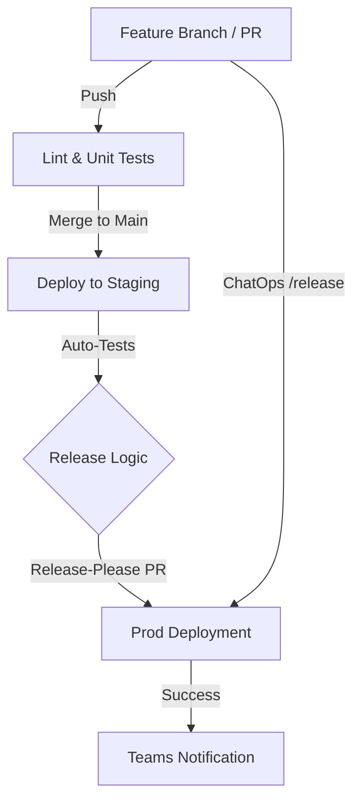

# Design Document: Databricks DataOps Platform

## Status

| Field       | Value           |
|-------------|-----------------|
| **Status**  | DRAFT/IN-REVIEW |
| **Updated** | [2026-02-23]    |

---

## Abstract

The Databricks DataOps Platform is a framework designed to automate the deployment of Databricks resources while protecting the integrity of **Production** environments. By employing a **Colocated DAB Pattern**, the system prevents resource duplication and utilizes **GitHub Actions** to orchestrate a robust CI/CD pipeline.

## Background

The platform was proposed to solve critical issues of resource duplication, such as scenarios where dashboards or jobs with identical names are accidentally published or overwritten. Current manual processes are replaced by an automated system that ensures every change is validated, versioned, and promoted through a structured lifecycle.

## Goals & Non-Goals

### Goals

* [ ] Automate resource deployment using **Databricks Asset Bundles (DABs)** and **Taskfiles**.
* [ ] Implement **GitOps** for deployments via GitHub Actions to validate and version changes.
* [ ] Enforce **Semantic Versioning (SemVer)** through the `release-please` action based on Conventional Commits.
* [ ] Provide a **ChatOps** "escape hatch" (`/release`) for accelerated production releases.

## Proposed Architecture

### 1. Declarative Infrastructure (DABs)

The platform uses the **Databricks Asset Bundle (DAB)** as a declarative framework for defining resources as code. The `databricks.yml` file serves as the "Skeleton," coordinating imported resources and global variables used by the Databricks CLI to assemble deployment packages.

### 2. Environment Strategy & Isolation

The architecture utilizes a three-tier isolation strategy:

* **Sandbox**: Personal development areas with unique namespaces per user and branch to prevent collisions.
* **Staging**: An integration layer where code is automatically validated against production-like settings.
* **Production**: A restricted "Source of Truth" accessible only through automated service principals.

### 3. CI/CD Orchestration

The pipeline employs a dual-path deployment strategy:

* **Standard Path**: Involves automated linting, unit tests on feature branches, and promotion to Staging upon merging to `main`. Final production deployment is triggered by merging a `release-please` PR.
* **Fast-Track Path**: Allows developers to bypass the standard cycle by commenting `/release` on a PR, initiating an immediate merge and production deployment.

### 4. Command Interface (Taskfile)

A **Taskfile** acts as a human-readable wrapper for complex CLI commands, abstracting environment-specific logic for developers. This includes specific tasks for deploying to sandbox, staging, and production targets.

## Technical Sepcification

## 1. CI/CD & The "Fast-Track" Release

This section outlines the lifecycle of a code change as it moves through the automated pipeline. The platform employs a dual-path deployment strategy: a standard, versioned release cycle for planned updates and a "Fast-Track" ChatOps path for emergency hotfixes and urgent deliveries.


### 1.1 The Deployment Workflow

1. **Continuous Integration (CI)**: Pushes to any feature branch trigger automated linting and unit tests to ensure code quality before reaching the peer review stage.
2. **Staging Promotion**: Upon merging a Pull Request into the `main` branch, the bundle is automatically deployed to the Staging environment.
3. **Integration Testing**: Automated resource validation tests run against the Staging environment to confirm that the Databricks Jobs, DLT pipelines, and Dashboards function correctly in a production-like setting.
4. **Version Management**: The `release-please` action monitors the `main` branch, automatically aggregating commits to create a Release PR that handles Semantic Versioning (SemVer) and changelog updates.
5. **Production Release**: Merging the Release PR triggers the production workflow, deploying assets to the Production environment using a Service Principal identity for maximum security.
6. **Fast-Track "Escape Hatch"**: Developers can bypass the standard release cycle by commenting `/release` on an open PR. This triggers an immediate merge to `main` and initiates the Production deployment pipeline, providing an accelerated path for urgent changes.


### 1.2 Workflow Visualization



### 1.3 Automated Versioning (SemVer)

We will use **Release Please** to calculate version bumps based on Conventional Commits:

* **`fix:`** ➔ Patch (1.0.1)
* **`feat:`** ➔ Minor (1.1.0)
* **`feat!:`** ➔ Major (2.0.0)

**ChatOps Feedback Loop:**

* **Start**: "🚀 Fast-Track Release Initialized. I’m merging this feature and triggering the production release now."
* **Complete**: "✅ Release Complete. The Release PR has been merged, and the Production deployment is underway."
* **Failure**: "❌ Fast-Track Release Failed. I encountered an error... Please check GitHub Actions logs."

---

## 2. Standardized Project Blueprint

This layout will be the standard layout for all current and future Databricks projects to ensure cross-team compatibility and ease of maintenance.

```text
.
├── databricks.yml              # Main coordinator (The "Skeleton")
├── Taskfile.yml                # Command abstraction layer
├── .github/
│   └── workflows/              # CI/CD Pipeline definitions
├── targets/                    # Environment-specific overrides
│   ├── sandbox.yml             # Personal dev settings
│   ├── staging.yml             # Integration settings
│   └── prod.yml                # Production Service Principal settings
├── resources/                  # Shared resource definitions
│   ├── jobs.yml                # Workflow definitions
│   ├── pipelines.yml           # DLT definitions
│   └── dashboards.yml          # AI/BI Dashboard definitions
├── src/                        # Code (Notebooks, Python, SQL)
├── scripts/                    # Automation (db_setup.sh, db_notify.sh)
├── tests/                      # Pytest validation suites
├── requirements-dev.txt        # Local dev dependencies
└── .gitignore                  # Excludes .bundle/, secrets, and caches


```

---

## 3. Configuration & Automation Components

### 3.1 The Coordinator (`databricks.yml`)

The Databricks Asset Bundle (DAB) is a declarative framework for defining Databricks resources as code. The `databricks.yml` file acts as the primary "Skeleton," importing resources and defining global variables that the Databricks CLI uses to assemble the deployment package.

```yaml
bundle:
  name: marketing_analytics

include:
  - targets/*.yml
  - resources/*.yml


```

### 3.2 Target Overrides (`targets/`)

Targets provide environment-specific configurations. The CLI merges the base bundle with the specific target logic during deployment.

* **Sandbox**: For local iteration. Unique `root_path` prevents overwriting others' work.
* **Staging**: For final integration testing before production.
* **Production**: The locked environment using **Service Principal** identities.

**Variables and CLI Arguments:**
Variables allow for dynamic configuration. For example, in `sandbox.yml`, we use:

* `${workspace.current_user.short_name}`: To identify the developer.
* `${bundle.git_branch}`: To isolate different features.

These can be overridden via the CLI:
`databricks bundle deploy -t sandbox --var "catalog_name=experimental_catalog"`

### 3.3 Resource Definitions (`resources/`)

Files in this directory define the *what* of the project. By modularizing these, complex workflows can be managed in smaller, readable chunks.

The `resources/` directory defines the high-level Databricks objects (Jobs, DLT Pipelines, Dashboards) that the bundle will create and manage. By separating these into logical files, we maintain a clean and scalable configuration that can be easily reviewed during the PR process.

#### 3.3.1 Resource Categorization

Resources are split by type to prevent a single, unmanageable YAML file:

* **`dashboards.yml`**: Defines AI/BI dashboards, including layout, widgets, and data sources.
* **`jobs.yml`**: Configures multi-task workflows, including trigger schedules (cron), email notifications on failure, and cluster requirements.
* **`pipelines.yml`**: Specific to Delta Live Tables (DLT), defining materialization logic and data quality constraints (Expectations).

#### 3.3.2 Resource Overrides & Shared Logic

Because the `databricks.yml` coordinates these files, it is possible to define a "base" resource and then apply environment-specific tweaks in the targets. For example, a job might run on a small shared cluster in **Staging** but move to a high-concurrency SQL Warehouse in **Production**.

#### 3.3.3 Implementation Example: `resources/jobs.yml`

```yaml
resources:
  jobs:
    daily_ingestion_job:
      name: "[${bundle.target}] Daily Sales Ingestion"
      tasks:
        - task_key: refresh_tables
          notebook_task:
            notebook_path: ../src/notebooks/ingest_sales.py
      job_clusters:
        - job_cluster_key: default_cluster
          new_cluster:
            spark_version: "14.3.x-scala2.12"
            node_type_id: "Standard_DS3_v2"
            num_workers: 2


```

---

## 4. The Command Interface (`Taskfile.yml`)

The Taskfile acts as a human-readable wrapper for complex CLI commands. Here is a small excerpt. 

```yaml
version: '3'

tasks:
  db-deploy:sandbox:
    desc: "Deploy to personal sandbox"
    cmds:
      - databricks bundle deploy -t sandbox

  db-deploy:staging:
    desc: "Deploy to staging (Internal use/CI)"
    cmds:
      - databricks bundle deploy -t staging

  db-deploy:prod:
    desc: "Deploy to production (Service Principal only)"
    cmds:
      - databricks bundle deploy -t prod --var "sp_id=${PROD_SP_ID}"

```


Based on the example, each task has three main elements:

1.  **Task Name** (`db-deploy:sandbox`): The unique identifier you run from the command line (e.g., `task db-deploy:sandbox`). The colon (`:`) is a convention for grouping related tasks.
2.  **Description** (`desc`): A human-readable summary of what the task does, which appears when listing available tasks.
3.  **Commands** (`cmds`): A list of the actual shell commands to execute. In this case, it runs the `databricks bundle deploy` command with the appropriate target (`-t sandbox`).

---

## 5. GitHub Workflows (`.github/workflows/`)

Common files include `lint.yml` (PR validation), `staging.yml` (on push to main), and `production.yml` (on release).

**Example Production Deployment Snippet:**

```yaml
name: Production Deployment
on:
  release:
    types: [published]
jobs:
  deploy:
    runs-on: ubuntu-latest
    steps:
      - uses: actions/checkout@v4
      - name: Deploy DAB to Prod
        run: task db-deploy:prod
        env:
          DATABRICKS_HOST: ${{ secrets.DB_HOST }}
          DATABRICKS_TOKEN: ${{ secrets.DB_TOKEN }}
          PROD_SP_ID: ${{ secrets.PROD_SP_ID }}


```
---

## 6. Testing & Quality Assurance

To protect **Production** and eliminate resource duplication, the platform enforces a multi-layered testing strategy for all assets.

### 6.1 Testing Layers

* **Unit Testing (Local/CI)**: Validates code structure on every push.

Unit tests can be run locally with a command like `task test:unit`.

**Example Unit Test**

```python
import pytest
import yaml
import os

DASHBOARD_CONFIG_PATH = "resources/dashboards.yml"

def load_dashboard_config():
    if not os.path.exists(DASHBOARD_CONFIG_PATH):
        pytest.fail(f"Config file not found at {DASHBOARD_CONFIG_PATH}")
    with open(DASHBOARD_CONFIG_PATH, "r") as f:
        return yaml.safe_load(f)

def test_dashboard_file_path_exists():
    """
    Validates that the source JSON file for the dashboard exists in the src directory.
    """
    config = load_dashboard_config()
    dashboards = config.get("resources", {}).get("dashboards", {})    
    for dash_id, settings in dashboards.items():
        file_path = settings.get("file_path", "")
        actual_path = os.path.join("resources", file_path)
        assert os.path.exists(actual_path), f"Dashboard source file not found: {actual_path}"
```

* **Integration Testing (Staging)**: Verifies live functionality after deploymenting to Staging.

**Example Integration Test**
```python
import pytest
from databricks.sdk import WorkspaceClient
from databricks.sdk.service import iam, dashboards

@pytest.fixture
def ws():
    return WorkspaceClient()

def test_dashboard_warehouse_connection(ws):
    """
    Validates that the dashboard is linked to a functional 
    SQL Warehouse in the current environment.
    """
    dash = [d for d in ws.dashboards.list() if "Daily Sales" in d.display_name][0]
    warehouse_id = dash.warehouse_id
    warehouse = ws.warehouses.get(warehouse_id)
    assert warehouse.state.value in ["RUNNING", "STARTING"], \
        f"Dashboard warehouse {warehouse_id} is in invalid state: {warehouse.state.value}."
```

* **Non-Functional Testing (Staging/Prod)**: Evaluates performance and reliability.

**Example Non-functional Test**
```python
import pytest
import time
from databricks.sdk import WorkspaceClient
from databricks.sdk.service import sql

MAX_ACCEPTED_LATENCY_SEC = 5.0

@pytest.fixture
def ws():
    return WorkspaceClient()

def test_daily_sales_query_performance(ws):
    """
    Executes the core 'Daily Sales' SQL logic and validates 
    that latency is within the 5s threshold.
    """
    warehouse_id = "your_warehouse_id_from_targets" 
    sales_query = "SELECT sum(amount), date FROM main.sales.daily_transactions GROUP BY date"

    start_time = time.time()
    query_exec = ws.statement_execution.execute_statement(
        warehouse_id=warehouse_id,
        statement=sales_query,
        catalog="main" # Or derived from ${var.source_catalog}
    )
    execution_time = time.time() - start_time

    assert execution_time < MAX_ACCEPTED_LATENCY_SEC, \
        f"Latency failure: Query took {execution_time:.2f}s, exceeding SLO of {MAX_ACCEPTED_LATENCY_SEC}s."
```

### 6.2 Summary Table

| Phase | Test Focus | Tooling | Environment |
| --- | --- | --- | --- |
| **CI** | Schema, Naming, SQL Syntax | `pytest`, DAB CLI | Feature Branch |
| **Promotion** | API validation, ACLs, Connectivity | `pytest`, Databricks SDK | Staging |
| **Release** | Latency SLOs, Warehouse Scaling | SQL Execution API | Staging/Prod |


---

## 7. Automated Notifications via MS Teams

To support the **ChatOps** feedback loop, the platform integrates with **MS Teams Webhooks** to alert the team when a pipeline fails in **Staging** or **Production**.

### 7.1 Implementation Strategy

* **Trigger**: Uses the `if: failure()` conditional in GitHub Actions to ensure notifications only fire on errors.
* **Context**: Sends the **Bundle Name**, **Environment**, and **SemVer** along with a direct link to the failed run.
* **Fast-Track Support**: Directly supports the **ChatOps** "Failure" state by providing immediate error visibility.

### 7.2 GitHub Workflow Snippet

```yaml
- name: Notify Teams on Failure
  if: failure() # Only executes if a previous step fails
  run: |
    bash scripts/db_notify.sh \
      --status "Failed" \
      --env "${{ env.TARGET_ENV }}" \
      --version "${{ var.bundle_version }}" \
      --webhook_url "${{ secrets.TEAMS_WEBHOOK_URL }}"
  env:
    # Captures context for the notification
    TARGET_ENV: prod

```

### 7.3 Payload Script (`scripts/db_notify.sh`)

This script constructs the JSON payload required by Teams.

```bash
#!/bin/bash
# scripts/db_notify.sh
# Simplified curl command for Teams Webhook

curl -H "Content-Type: application/json" \
     -d "{
           'type': 'message',
           'attachments': [{
             'contentType': 'application/vnd.microsoft.card.adaptive',
             'content': {
               'body': [{
                 'type': 'TextBlock',
                 'text': '❌ Deployment Failed: $BUNDLE_NAME',
                 'weight': 'bolder'
               }, {
                 'type': 'TextBlock',
                 'text': 'Env: $ENV | Version: $VERSION'
               }]
             }
           }]
         }" $WEBHOOK_URL

```
---
## 8. Technology Stack & Resource Directory

This section provides a centralized directory of the core technologies, tools, and documentation links that comprise our DataOps platform.

| Component | Technology | Purpose | Documentation |
| --- | --- | --- | --- |
| **Core Framework** | **Databricks Asset Bundles (DABs)** | Declarative infrastructure & resource management. | [DABs Docs](https://docs.databricks.com/en/dev-tools/bundles/index.html) |
| **Task Runner** | **Go Task (Taskfile)** | Command-line abstraction and dev automation. | [Taskfile Guide](https://taskfile.dev/usage/) |
| **CI/CD Platform** | **GitHub Actions** | Orchestration of tests, merges, and deployments. | [GH Actions Docs](https://docs.github.com/en/actions) |
| **Local CI Testing** | **act** | Runs GitHub Actions locally to speed up pipeline dev. | [act Repository](https://github.com/nektos/act) |
| **Version Manager** | **Release Please** | Automates SemVer and Changelog generation. | [Release Please Docs](https://github.com/googleapis/release-please) |
| **Testing Suite** | **pytest** | Python framework for unit and resource validation. | [pytest Docs](https://docs.pytest.org/) |
| **Secret Logic** | **Databricks CLI** | Used for secret-scope creation and API interaction. | [CLI Reference](https://docs.databricks.com/en/dev-tools/cli/index.html) |
| **Communication** | **MS Teams Webhooks** | Automated deployment notifications and ChatOps. | [Teams Webhooks](https://learn.microsoft.com/en-us/microsoftteams/platform/webhooks-and-connectors/how-to/add-incoming-webhook) |
| **Standards** | **Conventional Commits** | Structured commit messages for automation logic. | [Convention Guide](https://www.conventionalcommits.org/) |


---

### Internal Documentation & Helpers

* **Databricks SDK for Python**: Essential for writing custom resource validation scripts in `tests/`.
* [Link: Databricks SDK Reference](https://databricks-sdk-py.readthedocs.io/)
